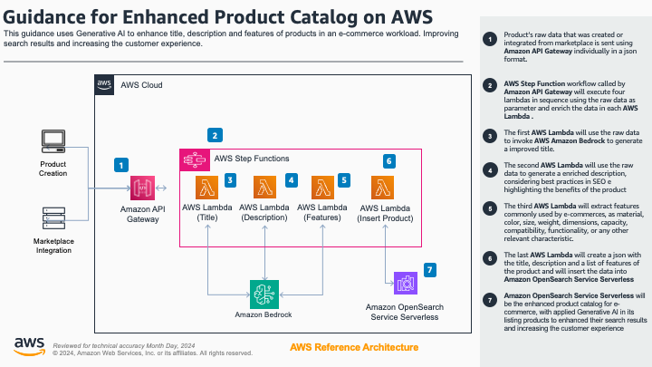
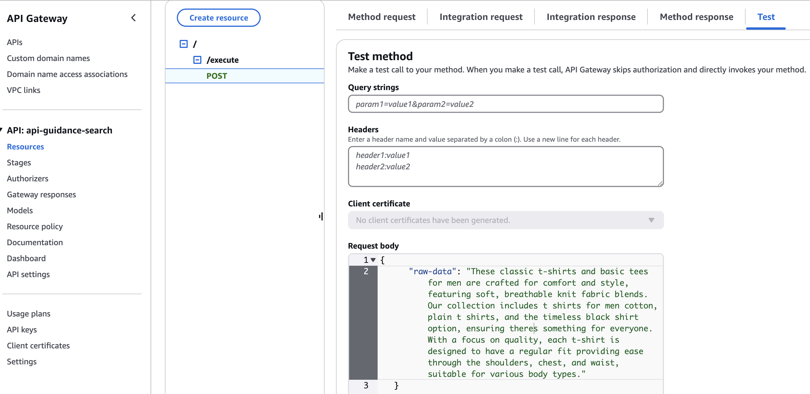
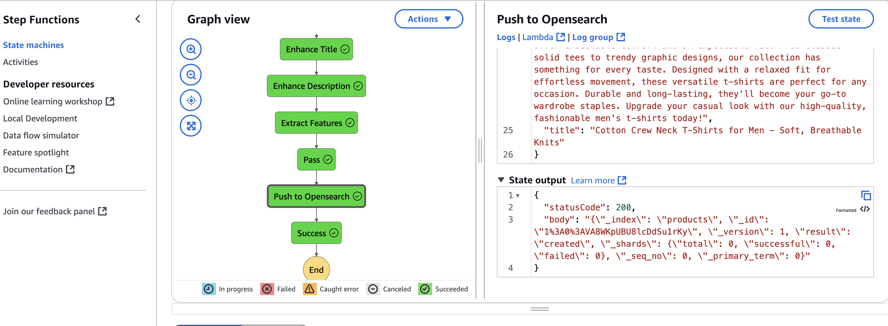

# Guidance for Enhanced Product Catalog with Generative AI on AWS

## Table of Contents

1. [Overview](#overview-required)
    - [Cost](#cost)
2. [Prerequisites](#prerequisites-required)
    - [Operating System](#operating-system-required)
3. [Deployment Steps](#deployment-steps-required)
4. [Deployment Validation](#deployment-validation-required)
5. [Running the Guidance](#running-the-guidance-required)
6. [Next Steps](#next-steps-required)
7. [Cleanup](#cleanup-required)
8. [FAQ, known issues, additional considerations, and limitations](#faq-known-issues-additional-considerations-and-limitations-optional)

## Overview

This guidance demonstrates how to leverage AWS services and Generative AI to enhance product catalogs for e-commerce applications. The architecture uses AWS services to ingest raw product data, process it using AI models, and create an enhanced product catalog with improved descriptions, titles, and extracted features.



Key components of the architecture:

1. Data Ingestion: Raw product data is sent via Amazon API Gateway or stored in an S3 bucket in JSON format.
2. Event Processing: New products in S3 trigger an event notification to populate an Amazon SQS queue.
3. Data Lookup: AWS Lambda functions consume messages from SQS or API Gateway, performing lookups in DynamoDB for processing rules.
4. Workflow Orchestration: AWS Step Functions manage the enhancement process.
5. AI Processing: AWS Lambda functions use Amazon Bedrock (Claude 3) to enhance product titles, descriptions, and extract features.
6. Data Storage: Enhanced product data is stored in Amazon OpenSearch Service Serverless for efficient querying and retrieval.

### Cost

You are responsible for the cost of the AWS services used while running this Guidance. As of March 2024, the cost for running this Guidance with the default settings in the US East (N. Virginia) Region is approximately $500.00 per month for processing 1,000,000 products.

We recommend creating a [Budget](https://docs.aws.amazon.com/cost-management/latest/userguide/budgets-managing-costs.html) through [AWS Cost Explorer](https://aws.amazon.com/aws-cost-management/aws-cost-explorer/) to help manage costs. Prices are subject to change. For full details, refer to the pricing webpage for each AWS service used in this Guidance.

### Sample Cost Table

The following table provides a sample cost breakdown for deploying this Guidance with the default parameters in the US East (N. Virginia) Region for one month.

| AWS service | Dimensions | Cost [USD] |
|-------------|------------|------------|
| Amazon API Gateway | 1,000,000 REST API calls per month | $3.50 |
| Amazon S3 | 100 GB storage, 1,000,000 PUT requests | $2.30 |
| Amazon SQS | 1,000,000 requests | $0.40 |
| AWS Lambda | 1,000,000 invocations, 1GB memory, 1 second duration | $16.67 |
| Amazon DynamoDB | 1 GB storage, 1,000,000 read/write requests | $1.25 |
| AWS Step Functions | 1,000,000 state transitions | $25.00 |
| Amazon Bedrock (Claude 3) | 1,000,000 inference requests | $400.00 |
| Amazon OpenSearch Service Serverless | 100 GB storage, 1,000,000 indexing requests | $50.00 |
| Total | | $499.12 |

## Prerequisites

### Operating System

These deployment instructions are optimized to best work on Amazon Linux 2 AMI. Deployment in another OS may require additional steps.

Required packages:
- AWS CLI (version 2.0 or later)
- Node.js (version 14.x or later)
- npm (version 6.x or later)
- Python (version 3.8 or later)
- pip (version 20.x or later)

To install these packages on Amazon Linux 2, run the following commands:

```bash
sudo yum update -y
sudo yum install -y aws-cli
curl -sL https://rpm.nodesource.com/setup_14.x | sudo bash -
sudo yum install -y nodejs
sudo yum install -y python3 python3-pip
```

### AWS account requirements

- Ensure you have the necessary permissions to create and manage the required AWS services.
- Enable Amazon Bedrock in your AWS account and request access to the Claude 3 model.
- Add the [necessary permissions](https://docs.aws.amazon.com/opensearch-service/latest/developerguide/security-iam-serverless.html#security_iam_id-based-policy-examples-data-plane) for the assumed role to view Opensearch Dashboards 

### aws cdk bootstrap

This Guidance uses AWS CDK. If you are using AWS CDK for the first time, perform the following bootstrapping:

```bash
npm install -g aws-cdk
cdk bootstrap aws://ACCOUNT-NUMBER/REGION
```

## Deployment Steps

<!-- 1. Clone the repository:
   ```bash
   git clone https://github.com/your-repo/product-catalog-enhancement.git
   cd product-catalog-enhancement
   ```

2. Create and activate a Python virtual environment:
   ```bash
   python3 -m venv .venv
   source .venv/bin/activate
   ```

3. Install required Python packages:
   ```bash
   pip install -r requirements.txt
   ```

4. Install CDK dependencies:
   ```bash
   npm install
   ```

5. Review and update the `cdk.json` file with your desired configuration parameters.

6. Deploy the CDK stack:
   ```bash
   cdk deploy
   ``` -->


1. This guidance uses AWS SAM framework, [follow install instructions for your environment](https://docs.aws.amazon.com/serverless-application-model/latest/developerguide/install-sam-cli.html)

2. Initilize the SAM environment
```
sam init
...
Which template source would you like to use?
	1 - AWS Quick Start Templates
	2 - Custom Template Location
Choice: 2

Template location (git, mercurial, http(s), zip, path): https://github.com/aws-solutions-library-samples/guidance-for-product-catalog-enhancement-with-generative-ai-on-aws/tree/main/deployment

```

3. Build SAM Assets
```
sam build
```

4. Configure account credentials
```
export AWS_ACCESS_KEY_ID=<YOUR_ACCESS_KEY>
export AWS_SECRET_ACCESS_KEY=<YOUR_SECRET_KEY>
export AWS_REGION=<YOUR_AWS_REGION>
```

4. Deploy solution 
```
sam deploy parameter --capabilities CAPABILITY_NAMED_IAM --guided
```

Fill necessary prompts from SAM CLI

>[!IMPORTANT] 
>The paramenter CAPABILITY_NAMED_IAM is needed for AWS Cloudformation create necessary roles and policies to the solution.


## Deployment Validation


1. After the successfull execution you should notice the following output in terminal:

```
Successfully created/updated stack - <STACK_NAME> in <AWS_REGION>
```

1. To test the product enhancement process via API Gateway:
   
   a. Open the AWS console and navigate into the API Gateway service, select APIs, api-guidance-search and POST method.

   b. Navigate into the "Test" tab

   c. In the Request Body pass the raw description of your product as in the example:
   ```
   {
      "raw-data": "These classic t-shirts and basic tees for men are crafted for comfort and style, featuring soft, breathable knit fabric blends. Our collection includes t shirts for men cotton, plain t shirts, and the timeless black shirt option, ensuring there's something for everyone. With a focus on quality, each t-shirt is designed to have a regular fit providing ease through the shoulders, chest, and waist, suitable for various body types."
   }
   ```

   

   d. You will receive a response body in the format:
   ````
   {"executionArn":"arn:aws:states:<REGION>:<Account-ID>:execution:StateMachine<XXXXX:GUID>","startDate":<TIMESTAMP>}
   
   ```
   if you see Serialization Errors, check for non UTF-8 characters in you raw-data


6. Checking the execution
   a. Use the search bar to navigate to AWS Step Function Service

   b. Click in State Machines, on the name of your StateMachine and select the last execution

   c. Check that all the steps have finished(it could take a few seconds)

   d. Check that the step "Push to Opensearch" returned a 200 statusCode.

   

   HINT: Navigate on each steps and check the enhanced text.


## Adapting the guidance for your environment

1. This guidance provide a private API Gateway. You can change the AWS Cloud Formation
to deploy it in your existing VPC. T

2. This API is already configured with Cognito authentication and a Cognito User pool is already deployed
   a. To create a user on the user pool: https://docs.aws.amazon.com/cognito/latest/developerguide/how-to-create-user-accounts.html
   b. To use the user to call the API externally: https://docs.aws.amazon.com/apigateway/latest/developerguide/apigateway-invoke-api-integrated-with-cognito-user-pool.html

3. This guidance provide an AWS OpenSearch Serverless domain, you can use your own OpenSearch product catalog changing the environment variable ENDPOINT in lambda search-guidance-PushOpensearchFunction-XXXX and the required role.

## Next Steps

- Customize the AI prompts in the Lambda functions to better suit your specific product catalog needs.
- Implement additional data validation and error handling in the ingestion process.
- Set up monitoring and alerting for the various components of the architecture.
- Explore integrating the enhanced product catalog with your e-commerce frontend or recommendation systems.

## Cleanup

To avoid incurring future charges, delete the resources created by this Guidance:

1. Delete the CDK stack:
   ```bash
   cdk destroy
   ```

2. Confirm the deletion when prompted.

3. Verify in the AWS CloudFormation console that the stack has been successfully deleted.

## FAQ, known issues, additional considerations, and limitations

**Known issues:**
- The Bedrock API may have rate limits that could affect processing speed for large catalogs. Consider implementing retry logic and backoff strategies in the Lambda functions.

**Additional considerations:**
- The OpenSearch domain is created with default settings. Adjust the instance type and storage based on your expected data volume and query patterns.

For any feedback, questions, or suggestions, please use the issues tab under this repository.
